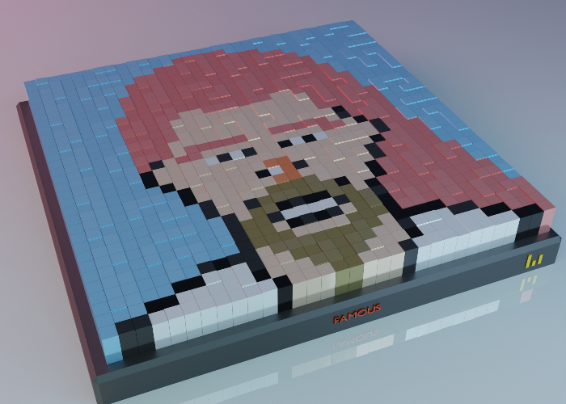

# CryptoBars-Famous: Collectible pixel arts dedicated to famous faces, on the Ethereum Blockchain

CryptoBars-Famous is a collection of 10000 unique collectibles of pixel art. Each piece is dedicated to one of the top 10k famous people in the world. Their name is written (pixel hight difference) over the piece in binary (0 and 1).

You can find list of peices and their dedicated charachter here:


## How it works
Here is the first piece, containing the dedicated to:

```
Chen Kaige
```

The name is repeated with an space between.



The first row of the piece contains:
C: 01000011
h: 01101000
e: 01100101
n: 01101110
 : 00100000
K: 01001011
a: 01100001
i: 01101001
g: 01100111
e: 01100101
